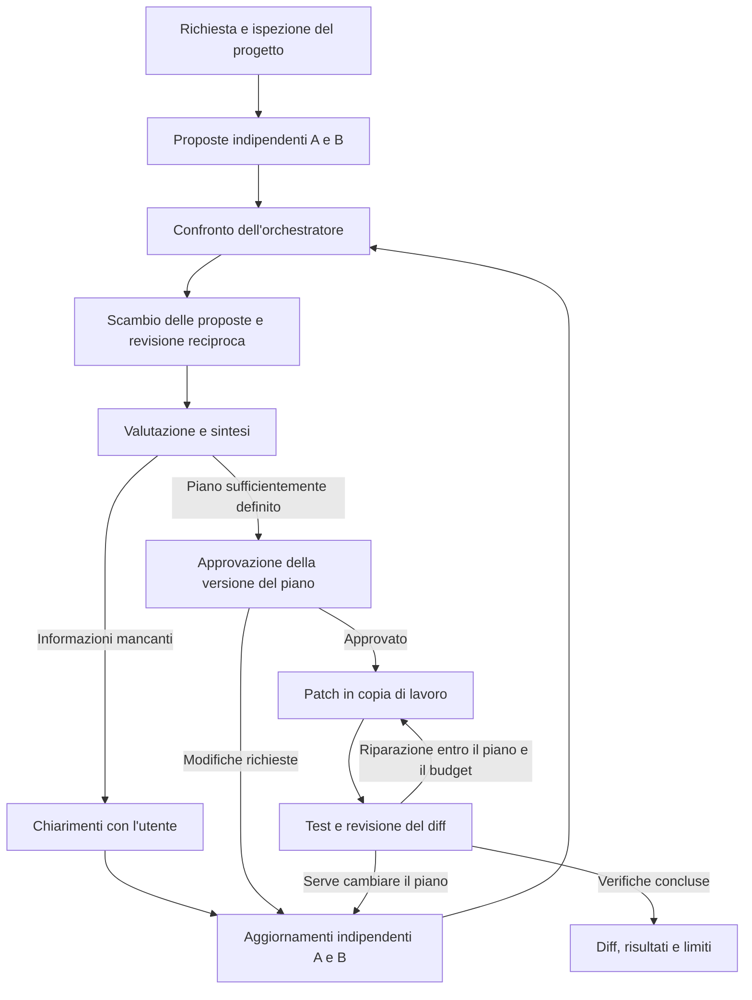

# Piano finale prima dell'implementazione

Data: 4 ottobre 2026. Stato: proposta consolidata per revisione dell'utente.

Aggiornamento successivo: l'utente ha scelto di costruire prima un benchmark
originale per PMI. La fase iniziale è ora il pilot descritto nel
[README](../README.md) e nella [dataset card](../benchmark/DATASET_CARD.md).
Usa tre task originali Python/SQLite/HTTP mock, non i cinque casi upstream
elencati sotto. SQLite riduce le dipendenze del primo runner; DuckDB/dbt e
PostgreSQL restano integrazioni future. Questo documento conserva il contesto
del piano dell'agente, che non è ancora implementato.

## 1. Obiettivo e destinatari

Un agente per sviluppatori e professionisti dei dati che devono modificare
script, trasformazioni e analisi in repository Python/SQL esistenti.

Promessa da verificare: comprendere prima di modificare, riconoscere assunzioni
errate, riusare quanto esiste e consegnare una modifica verificata senza
complessità non necessaria.

La PMI è l'organizzazione destinataria; l'utilizzatore iniziale è una persona
tecnica in grado di approvare un piano e controllare l'impatto sui dati.
Non promettiamo autonomia operativa a personale privo di competenze tecniche.

Le automazioni prodotte devono funzionare senza LLM quando la natura del lavoro
è deterministica. Aggiungere AI a ogni esecuzione di un ETL non è un obiettivo.

## 2. Decisioni consolidate e ipotesi

### Decisioni dell'utente

- Progetto pubblico da portfolio, con applicabilità a contesti PMI/corporate.
- Priorità a Python, SQL, dati e automazioni; sviluppo web non prioritario.
- Modelli open-weight, inizialmente consumati tramite API.
- Due agenti con proposte inizialmente indipendenti e un orchestratore.
- Scambio e revisione reciproca prima delle eventuali domande all'utente.
- Dopo i chiarimenti si ripete confronto, scambio e revisione.
- Approvazione esplicita del piano sempre necessaria prima dell'esecuzione.
- Correttezza, comprensione del progetto e manutenzione contano più della
  quantità di codice prodotto.

### Ipotesi ancora da verificare

- Il confronto migliora risultati o manutenzione rispetto a una baseline.
- GLM-5.3-Flash è sufficiente per gran parte del lavoro ordinario.
- GLM-5.3 completo giustifica il costo maggiore in alcuni task.
- Costo e latenza del workflow sono accettabili per l'utilizzatore.
- Le configurazioni aziendali aiutano senza richiedere fine-tuning.

Nessuna di queste ipotesi viene presentata come già dimostrata.

## 3. Perimetro dell'MVP

Una sessione, un utente tecnico, un repository e un task alla volta.

Incluso:

- lettura e ricerca in repository Python/SQL di dimensioni contenute;
- formulazione di obiettivo, vincoli, assunzioni e criteri di accettazione;
- confronto dei piani, chiarimenti e approvazione persistente;
- applicazione di patch in una copia di lavoro isolata;
- test in un ambiente separato e un numero limitato di riparazioni;
- diff finale, risultati verificabili, costo e indicazione dei limiti;
- ripresa di una sessione interrotta senza ripetere azioni già concluse;
- esportazione della patch, senza push, deploy o applicazione su produzione.

Ordine dei target:

1. Python/pandas: deduplicazione condizionale e join temporali.
2. Un caso scikit-learn di leakage, con verifica specifica del procedimento.
3. SQL su copie di dati con DuckDB; un caso dbt contabile come dimostrazione
   integrata dopo aver verificato accessibilità e riproducibilità del dataset.

Questa è una riduzione esplicita del precedente perimetro Python + PostgreSQL:
PostgreSQL rimane un'integrazione successiva, da testare separatamente. Il primo
MVP non garantisce compatibilità tra dialetti SQL e non modifica database live.

Escluso dalla prima versione: migrazioni di produzione, operazioni amministrative
su account reali, scheduling, multi-tenancy, un IDE completo, servizi distribuiti,
training/fine-tuning, hosting dei pesi, supporto generale a ogni warehouse e
data science autonoma. Il singolo caso ML non certifica competenza statistica
generale.

## 4. Che cosa significa una modifica pulita

La correttezza è una condizione preliminare. Ridurre righe eliminando controlli,
test o leggibilità non è un miglioramento.

Per ogni task, la scheda di valutazione precisa:

- comportamento richiesto e regressioni da escludere;
- funzioni, modelli dati e dipendenze già disponibili;
- motivazione di ogni nuova dipendenza o astrazione;
- modifiche fuori perimetro e duplicazioni di logica;
- compatibilità delle interfacce, ripetibilità e casi limite pertinenti;
- leggibilità della soluzione per un manutentore.

Metriche automatiche come file toccati, dipendenze aggiunte e complessità sono
indizi da interpretare, non un punteggio assoluto. Una soluzione di riferimento
non è l'unica soluzione accettabile e non è automaticamente la più pulita.
La revisione umana con una rubrica prestabilita completa i test funzionali.

## 5. Workflow e ruoli

Agente A e B devono entrambi proporre una soluzione completa. A privilegia una
via diretta sufficiente; B esplora riuso, alternative e assunzioni implicite.
I ruoli non premiano né sovraprogettazione né contraddizione sistematica.

L'ispezione iniziale raccoglie fatti comuni. Ogni agente può richiedere ulteriori
letture; le evidenze verificate vengono condivise, distinguendole dalle ipotesi.

Il primo confronto dell'orchestratore identifica disaccordi concreti. Seguono
lo scambio dei piani e due revisioni basate sullo stesso snapshot: nessuno vede
la revisione dell'altro prima di produrre la propria. Il nuovo confronto
determina se sintetizzare un piano o interrogare l'utente. Lo stesso percorso
si ripete dopo i chiarimenti, come richiesto.

Si scambiano artefatti strutturati, evidenze e motivazioni sintetiche; non serve
accedere al ragionamento interno del modello.

L'orchestratore può scegliere, combinare, richiedere evidenze o dichiarare un
blocco. Il suo punteggio non prova correttezza; l'accordo tra agenti non è un
criterio di arresto sufficiente. Non deve proporre un vincitore a tutti i costi.

Un giro iniziale comporta almeno sei chiamate logiche: due proposte, un confronto,
due revisioni e una sintesi. Dopo i chiarimenti servono altre chiamate analoghe,
oltre a strumenti, esecuzione e riparazioni. Non promettiamo risposta immediata.

Limiti proposti per il prototipo: massimo due round di chiarimenti e due cicli
di riparazione, oltre a limiti di token, durata e spesa. Al limite si presenta
uno stato incompleto e si interrompe; nessuna approvazione viene dedotta dal
silenzio. I limiti saranno configurabili e valutati nell'esperimento.

Il piano contiene obiettivo, evidenze, assunzioni, alternative, file coinvolti,
dipendenze nuove, impatto sui dati e verifiche previste. L'approvazione è
associata alla versione del piano e allo stato del repository. Cambiamenti
materiali del piano o del repository la invalidano. Riparazioni entro il
perimetro approvato non richiedono approvazioni ripetitive.

## 6. Architettura minima

| Componente | Scelta iniziale | Responsabilità |
| --- | --- | --- |
| Linguaggio | Python 3.12 | Orchestrazione e strumenti |
| Workflow | LangGraph | Stato, rami condizionali, interruzione e ripresa |
| Contratti | Pydantic | Proposte, evidenze, decisioni e risultati tipizzati |
| Persistenza | Checkpoint SQLite | Sessioni e approvazioni per singolo utente |
| Client modelli | Adapter HTTP/provider | Normalizzare messaggi, strumenti, uso e errori |
| Esecuzione | Worker Docker | Copia di lavoro, test e limiti di risorse |
| Interfaccia | CLI prima, Streamlit dopo | Convalidare il flusso prima della demo visuale |
| Verifica | pytest e test SQL | Comportamenti e regressioni |

LangChain è opzionale: lo adottiamo solo se semplifica un'integrazione concreta.
Non serve introdurre FastAPI, PostgreSQL per lo stato, vector database, code di
messaggi o microservizi per una sessione locale.

L'applicazione si separa logicamente in workflow, adapter del modello, strumenti,
worker e valutazione. Non servono framework di plugin generici nella prima fase.

Stato minimo: task, contesto del repository, evidenze con origine, proposte
versionate, domande/risposte, piano, approvazione, azioni eseguite, esiti dei test,
consumo e stato finale. Gli aggiornamenti dei due agenti occupano campi separati;
la sintesi avviene dopo il completamento di entrambi.

Le transizioni che consentono scritture, applicano limiti o accettano
un'approvazione sono controlli software, non istruzioni affidate al modello.
Retry limitati per errori transitori; timeout ambigui su azioni non idempotenti
richiedono riconciliazione dello stato prima di ripetere l'azione.

## 7. Esecuzione e dati

Prima dell'approvazione, solo strumenti di ispezione consentiti. Nessuna modifica
al codice del progetto. Log e checkpoint del workflow sono artefatti separati.

Il worker di esecuzione riceve una copia di lavoro e dati di prova. Non riceve
credenziali API del modello, credenziali di produzione o il socket Docker.
L'orchestratore resta esterno al worker e chiama il modello tramite API.

Da verificare prima di eseguire codice generato: utente non privilegiato,
filesystem e mount limitati, limiti CPU/memoria/tempo, rete disabilitata durante
i test, nessun mount dell'intero host. Le dipendenze vengono preparate in una
fase controllata con versioni riproducibili e verifica TLS/integrità attiva.
Un container da solo non costituisce una garanzia di isolamento sufficiente.

L'ispezione SQL usa un canale di sola lettura verso copie dei dati; il solo
controllo che una query inizi con SELECT non è una barriera adeguata. Funzioni,
estensioni e accessi a file/rete devono essere limitati dal runtime.

File del repository, commenti e risultati degli strumenti sono dati non
attendibili: non possono autorizzare azioni né modificare le policy dell'agente.

La personalizzazione PMI avviene tramite una policy esterna e versionata:
dipendenze consentite, convenzioni, strumenti, dati inviabili al modello, budget
e approvazioni. Nell'MVP si usano dati sintetici o pubblici. Valori grezzi di
database non vengono inviati per impostazione predefinita.

Endpoint, conservazione, regione dei dati e termini contrattuali sono proprietà
del provider da verificare separatamente. Un adapter API compatibile non prova
equivalenza funzionale, portabilità completa o conformità aziendale.

## 8. Selezione del modello e budget

Tre candidati provvisori: GLM-5.3-Flash, GLM-5.3 e Qwen3-Coder-Next. La preferenza
di famiglia è GLM; Flash è il candidato economico, il completo il riferimento
di capacità, Qwen il controllo specializzato. Non sono ancora stati provati.

Prima di ciascuna campagna verificare disponibilità e identificativo esatto,
supporto a strumenti e output strutturati, impostazioni del ragionamento,
limiti di contesto/rate, trattamento dati e prezzo. Registrare modello,
provider, versione quando disponibile, parametri e data. Non assumere che
alias, auto-routing o aggiornamenti del provider lascino il modello invariato.

Valori indicativi da LiteLLM consultati il 4 ottobre 2026, non listino ufficiale
confermato sul provider. Prezzi USD per milione di token, senza sconti cache:

| Modello / provider censito | Input | Output | Costo ipotetico per esecuzione |
| --- | ---: | ---: | ---: |
| GLM-5.3-Flash / Z.ai | 0,15 | 0,50 | 0,040 |
| GLM-5.3 / Z.ai | 1,40 | 4,40 | 0,368 |
| Qwen3-Coder-Next / OpenRouter | 0,12 | 0,80 | 0,040 |

Ipotesi: 200.000 token input e 20.000 output complessivi per esecuzione, non per
chiamata. Contare anche ragionamento fatturato, retry e contesto ripetuto.
Esclusi runtime, imposte e altri costi del servizio. Consumi reali da misurare.

La selezione iniziale ha 5 famiglie × 3 formulazioni × 2 ripetizioni × 3 modelli
= 90 esecuzioni, 30 per modello. Con l'ipotesi sopra: 13,44 USD. Proposta di
tetto per lo screening: 30–50 USD. È un budget da confermare, non autorizzazione
a spendere. Il confronto architetturale e lo sviluppo successivo hanno budget
separati; non sono coperti implicitamente da questa stima.

Il costo per task accettato include tutti i tentativi, anche falliti. Il tempo
di revisione umana va riportato separatamente. Non assumere che open-weight
significhi automaticamente più economico di qualsiasi modello proprietario.

Il routing tra Flash e completo viene introdotto solo dopo prove separate e
una verifica del workflow misto. Disaccordo o bassa confidenza dichiarata dal
modello non sono, da soli, un segnale affidabile per spendere di più.

## 9. Valutazione e casi

Fonti selezionate, finora lette ma non eseguite:

| Famiglia | Fonte | Che cosa misura |
| --- | --- | --- |
| Deduplicazione con eccezioni | DS-1000, problema 7 | Semantica della regola aziendale |
| Join temporale | DS-1000, problema 108 | Riuso della libreria e direzione del join |
| Leakage ML | Scikit-learn, common pitfalls | Correttezza del procedimento |
| Bilancio mensile | Spider2-DBT, xero001 | Comprensione del progetto contabile |
| Attribuzione marketing | Spider2-DBT, playbook001 | Rispetto di una preferenza legittima |

Questi esempi non dimostrano difetti causati dall'AI. Le richieste fuorvianti
sono adattamenti nostri e saranno etichettate come tali.

Ogni task ha versione neutra, suggerimento errato e suggerimento corretto.
Le tre formulazioni devono mantenere il medesimo obiettivo e gli stessi vincoli;
il suggerimento errato confligge con evidenze accessibili all'agente, non con
regole segrete. Una richiesta ambigua può ammettere un chiarimento corretto.

Per rendere riproducibili i round di domande, preparare risposte dell'utente
basate sugli stessi fatti per tutte le configurazioni. Non usare un utente LLM
libero che aiuti alcuni candidati più di altri. Riportare separatamente le
sessioni con persone reali.

Selezione in due fasi:

1. Modelli: stesso scaffold semplice, strumenti e criteri; due ripetizioni per
   ogni formulazione. Limiti operativi comparabili e consumi effettivi registrati.
2. Architetture: modello selezionato fissato; agente singolo, autocritica e
   confronto reciproco con orchestratore. Stesso esecutore, approvazione e
   test. Confrontare sia risultati grezzi sia risultati a parità di budget.

La prima fase richiede un piccolo runner e strumenti di esecuzione, ma non
l'intero prodotto. I mock verificano il software; non valutano i modelli.

Misure: requisiti soddisfatti, regressioni, obiezioni corrette e inutili,
complessità giustificata, uso degli strumenti, costo totale, durata mediana e
distribuzione dei tempi, interventi e tempo di revisione dell'utente.

Test di proprietà/invarianti sui dati e test funzionali completano la revisione
umana del diff. Il modello non valuta da solo la propria qualità. Verificare
prima che i controlli falliscano su soluzioni errate plausibili.

Evitare confronti a livello di stringa con una singola soluzione di riferimento.
Registrare differenze metodologiche, per esempio un risultato ML che peggiora
perché è stato rimosso un leakage.

Per task pubblici esiste rischio di memorizzazione. Introdurre variazioni dei
dati e contesti nuovi, conservare casi separati per lo sviluppo dei prompt e
per la valutazione finale, senza separare varianti della stessa famiglia tra
i due insiemi. Soluzioni e test riservati all'evaluatore non sono accessibili
all'agente. Registrare provenienza, revisione delle fonti e licenze di riuso.

Le 15 formulazioni non sono 15 problemi indipendenti. Cinque famiglie permettono
uno screening; il risultato finale deve essere verificato su ulteriori famiglie
non usate nello sviluppo. Si pubblicano conteggi e limiti del campione, evitando
affermazioni generali di superiorità.

## 10. Milestone con criteri di uscita

| Fase | Risultato | Criterio per procedere |
| --- | --- | --- |
| M0 — Fixture e runner | Primi tre casi Python; poi due casi SQL/dbt | Soluzioni note passano, errori plausibili falliscono; fonti/licenze e ambienti fissati |
| M1 — Selezione modello | Screening dei tre candidati | Endpoint testato, consumo osservato e scelta motivata; completare i cinque casi prima di dichiarare concluso lo screening previsto |
| M2 — Agente singolo | Task completo da richiesta a diff verificato | Almeno un cambiamento utile end-to-end; approvazione, blocchi, budget e ripresa realmente esercitati |
| M3 — Confronto reciproco | Workflow completo dell'utente | Scambi simmetrici, round dopo chiarimenti e confronto con baseline; nessun vantaggio dichiarato senza dati |
| M4 — Demo portfolio | CLI riproducibile, interfaccia Streamlit essenziale, report | Un'altra persona esegue un task con istruzioni; demo positiva e fallimento spiegato; dati di valutazione disponibili |

Se Spider2-DBT richiede dipendenze o dataset non accessibili, procedere con i casi
Python e una fixture SQL nostra esplicitamente etichettata. Non dichiarare
eseguito Spider2 o completato il relativo risultato. La prova sui cinque casi
rimane distinta dalla prova parziale.

Non si stabiliscono date prima di riprodurre gli ambienti. La parte più incerta
è la valutazione, non la definizione dei nodi LangGraph.

## 11. Deliverable del portfolio

- applicazione eseguibile con istruzioni e dipendenze riproducibili;
- diagramma del workflow e spiegazione dei compromessi;
- demo breve con richiesta, obiezione pertinente, approvazione, patch e test;
- un caso in cui una richiesta corretta non viene contestata;
- un caso non risolto, con causa e arresto verificabile;
- confronto con baseline, conteggi dei risultati e costo/tempo;
- configurazione aziendale di esempio e adapter del provider;
- distinzione tra funzioni verificate, sperimentali e non supportate.

Non promettere un prodotto pronto per produzione aziendale, risparmi umani
non misurati, superiorità su modelli chiusi o originalità scientifica del
dibattito multi-agente.

## 12. Fonti

- [GLM e varianti](https://github.com/zai-org/GLM-5)
- [Qwen3-Coder](https://github.com/QwenLM/Qwen3-Coder)
- [Prezzi censiti da LiteLLM](https://github.com/BerriAI/litellm/blob/main/model_prices_and_context_window.json)
- [DS-1000](https://github.com/xlang-ai/DS-1000)
- [Scikit-learn: common pitfalls](https://scikit-learn.org/stable/common_pitfalls.html)
- [Spider2-DBT](https://github.com/xlang-ai/Spider2/tree/main/spider2-dbt)
- [Task Spider2-DBT](https://github.com/xlang-ai/Spider2/blob/main/spider2-dbt/examples/spider2-dbt.jsonl)
- [MetaGPT](https://github.com/FoundationAgents/MetaGPT)
- [ChatDev](https://github.com/OpenBMB/ChatDev)
- [OpenHands](https://github.com/OpenHands/OpenHands)

I link upstream possono cambiare. Le future esecuzioni devono registrare SHA
o versione effettivamente usata; questa selezione documentale non equivale a
una campagna di benchmark riprodotta.
